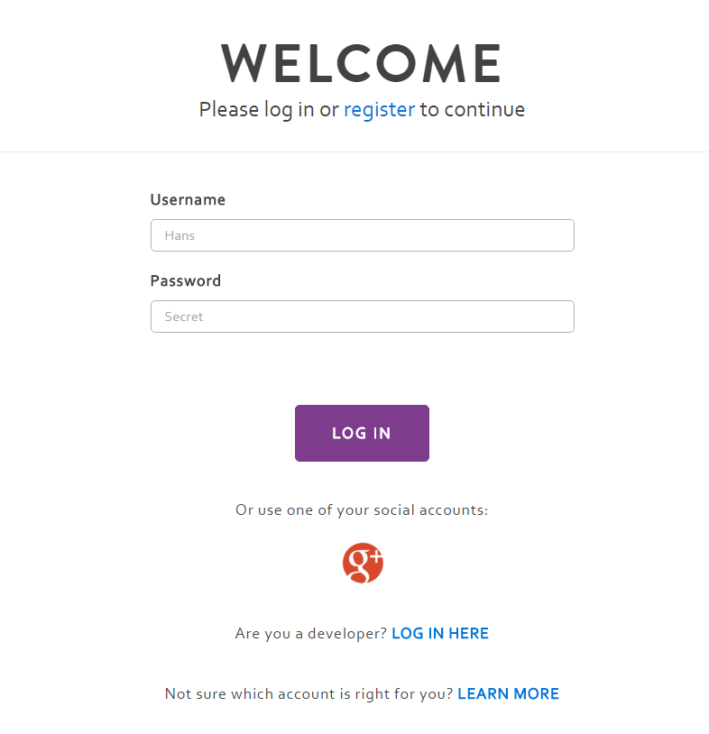
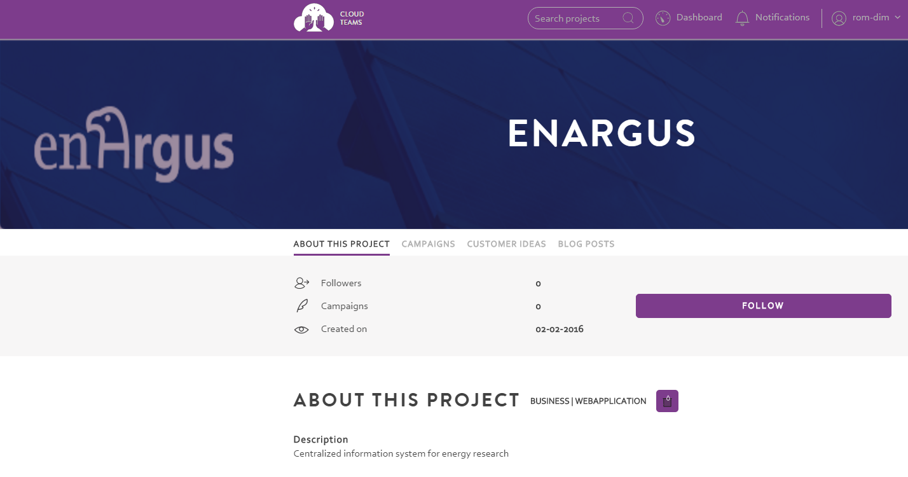
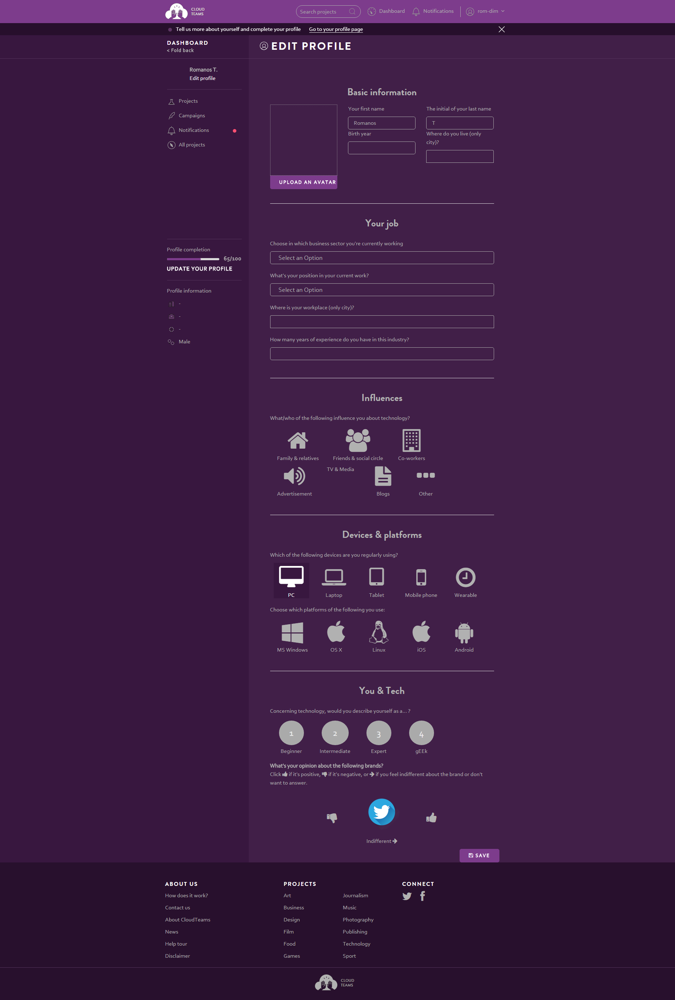
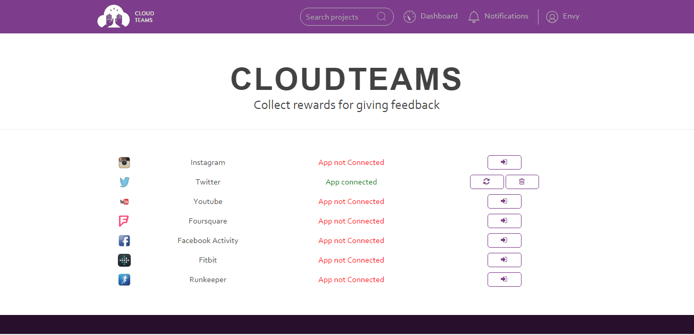

========
Customers Platform Usage
========

To use CloudTeams, you have to make an customer account::

	visit http://cloudteams.epu.ntua.gr:8008/

.. note::
    Customer account is needed for following and participating to new projects.

Create Account -- **Currently Not Available **
--------

- Go to visit http://cloudteams.epu.ntua.gr:8008/
- Create customer account

Login to Customeres Platform  
--------

- Go to visit http://cloudteams.epu.ntua.gr:8008/

- Login with your creadentials

View Projects
------------

Select project of interest and follow project:

Search for Projects
------------

Search on project of interest and follow project:

Edit user profile
------------

- Add info for your profile

Improve your profile with manually entered data
------------

- Add info for your profile

    

Improve your profile with automatically collected data
------------

- Synchronize social media accounts

- 

    

