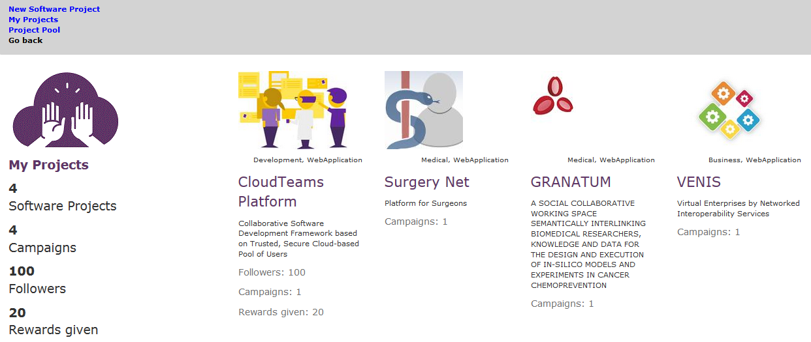
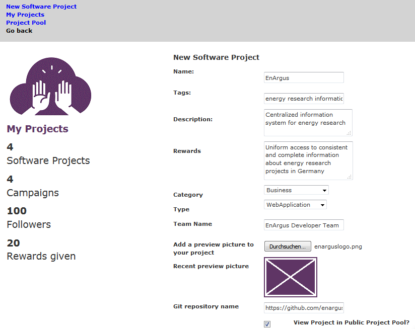
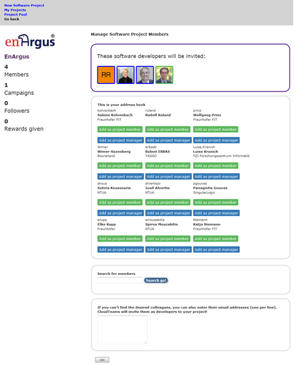
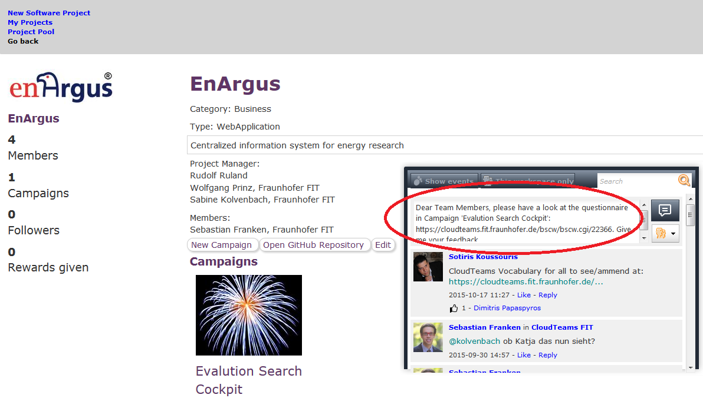
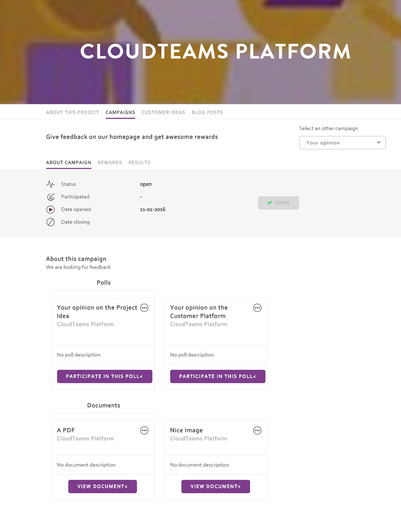
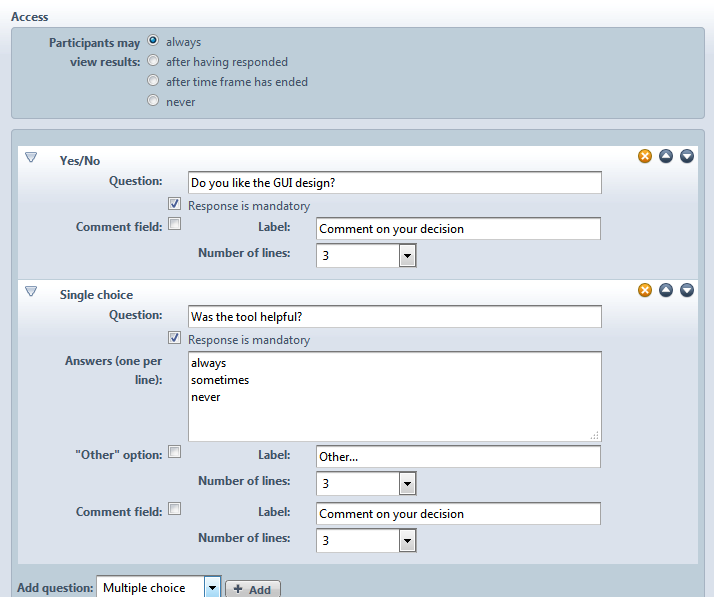
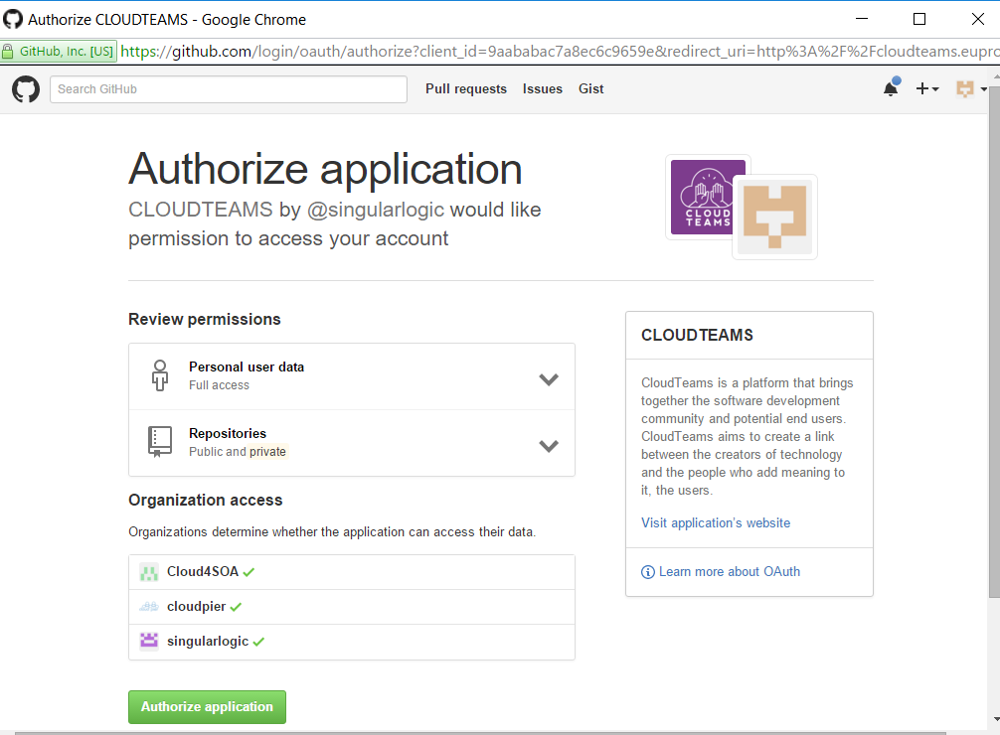

========
Team Platform Usage 
========

To use CloudTeams as a developer, you have to make an developer account::

	visit https://cloudteams.fit.fraunhofer.de/

.. note::
    Developer account is needed for the creation of new projects and the also the participation on the developement process of a project.

Create an Account for Team Plaform  -- **Currently Not Available**
--------

- Go to visit https://cloudteams.fit.fraunhofer.de/
- Create develper account

Login to Team Platform  
--------

- Go to visit https://cloudteams.fit.fraunhofer.de/

- Login with your creadentials

View Projects
------------

Select project of interest and follow project:

Create a new Project
----------

- create a project

Manage the Project Software Team
----------

- create a project

Communicate with the Software Team
----------

- Open micro blogging page
- Communicate with each member

Create a campaign
----------

- create a campaign

Create a campaign
----------

- create a questionnaire

Monitor a Github repository
----------

- Synchonize Github account

- Provide credentials to GitHub page

- Review and accept requested permissions on GitHub

- View GitHub info
.. image:: assets/githubresults.png

Monitor a project quality through SonarQube
----------

- Add a public SonarQube installation 

- Select ...

