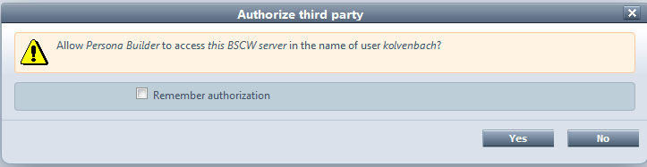
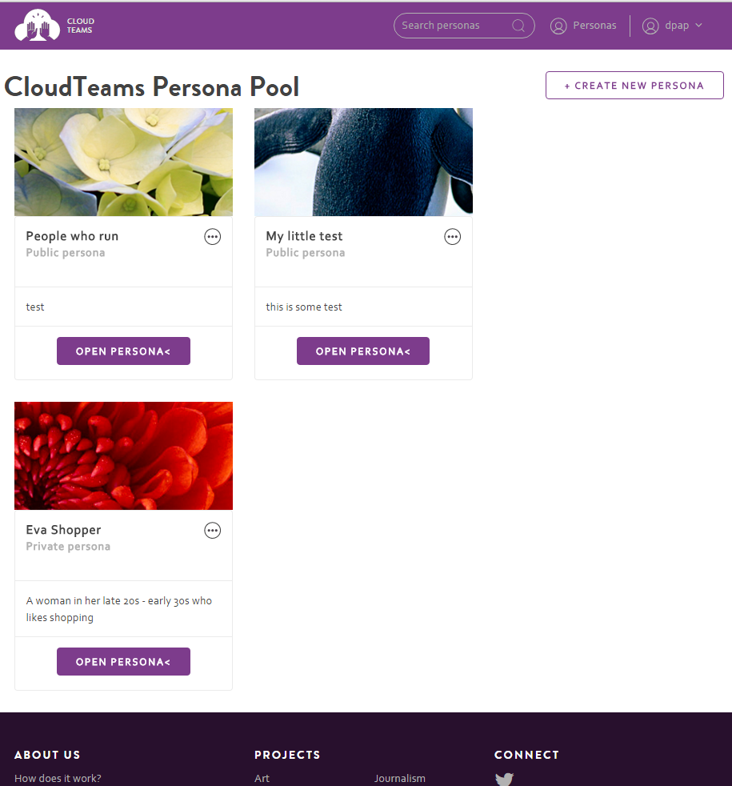
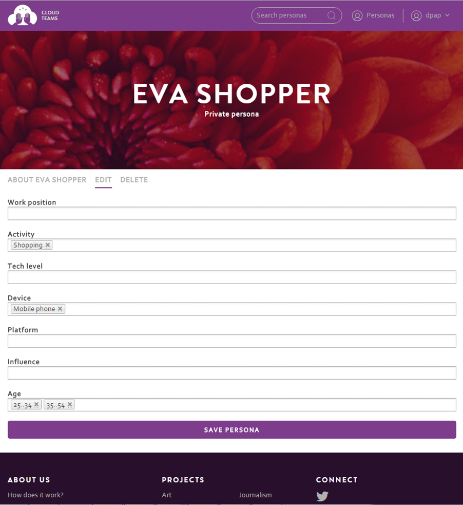
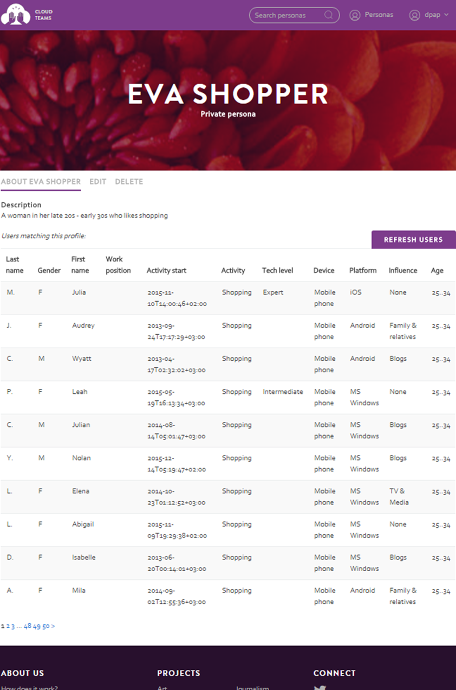

========
Persona Builder Usage 
========

To use Persona Builder as a developer, you have to make an developer account::

	visit http://cloudteams.epu.ntua.gr:8008/

.. note::
    Developer account is needed for the creation of new projects and the also the participation on the developement process of a project.

Create Account
--------

- Go to visit http://cloudteams.epu.ntua.gr:8008/
- Create develper account

Login to Persona Builder
--------
- Authenticate to Persona Builder

View Personas
------------

Select project of interest and follow project:

Create a new Persona
----------

- Select a project
- Create a persona

Match Users to Persona
----------
- Select a project
- Select a persona
- Find matching personas

